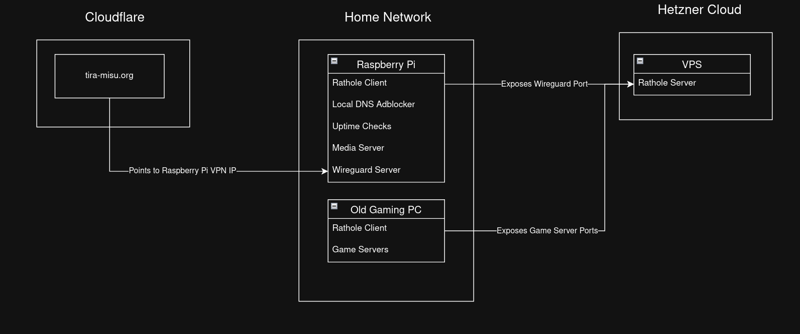

# Home Server Compose
This is my raspberri pi homeserver in a docker compose file.
The root compose contains all the applications that build the base.

## Getting Started
### Testing it out
If you just wanna test the basic functionality, I would remove traefik, pihole, acme.sh, rathole as these require the most setup. \
Then just uncomment the port mappings. By default, the containers are only available through traefik.

### Basic Setup
1. Create the media file directories. You can also already put your media there.
jellyfin/media/shows
jellyfin/media/movies

2. Configure pihole, acme.sh and traefik to support your domain and the automatic ssl certificates. For this, just copy the .env.examples variables into a .env with identical name. The compose will pick these up.
For testing purposes, pihole, traefik and acme.sh can also all be removed, to just use the port mappings.

3. Create the homepage .env
Feel free to keep everything empty for now. The widgets will not work but the homepage will still be able to start.

4. Start the root docker compose

5. Configure your router to use your pihole as a dns server.
To fully utilize Pihole as a network-wide ad-blocker, you need to configure it as your primary dns server for your network router. You also need to disable IPv6, as DHCPv6, as opposed to DHCPv4 is not a required protocol to implement. A lot of android phones *always* use the IPv6 DNS Server of Google.

### VPN
If you want to access your home server through a VPN you have 3 options:
1. Export the VPN (wireguard here) port through your router. This requires you to have a stable IP, which isn't often provided by ISP. You can use DynDNS to circumvent this.
2. Use a SaaS like Tailscale for a full service NAT Traversal VPN. Requires every device to have the dedicated tailscale app installed.
3. Use rathole for a NAT Traversal solution with the advantage of being able to use the native wireguard protocol everywhere.
I used 3 but if you throw out rathole, you can then just start replacing it with any of the other solutions.

*NAT Traversal using rathole*
For this you will need a VPS, VM or any comparable device outside of your home network thats publically reachable. I currently use a Hetzner Cloud VPS for 2$ a month, tho you can probably also find free tiers somewhere. 
It has basically 0 performance requirements, so just use the cheapest one you can find.

1. Create and run a compose file to run rathole on the server with a server config.
2. Take the ip address of the server and put it into the local rathole and put it into the client.toml.
For token/secret generation you can find examples in their [docs](https://github.com/rathole-org/rathole/blob/main/docs/transport.md)
3. Install wireguard locally and configure it. In the wireguard directory, you can find an example configuration, tho this is really just plain wireguard.

### SSL Automation
I bought the domain at cloudflare. If you dont, check [acme.sh](https://github.com/acmesh-official/acme.sh/tree/master/dnsapi) to see the required environment variables and entrypoint configs for your registrar.
1. Point cloudflare domain record to your VPS IP (or home network if you just expose the port).
2. Configure the traefik tls names and acme.sh secrets


### ARR-Stack
A popular stack to automate show and movie downloads. Requires a Usenet Server and Indexer Account. Otherwise you could also replace shadnzbd with qbittorrent and then utilize torrents.
The stack unfortunately doesn't have a lot of file configurations and thus needs a bit of manual setup to get going, which is mostly logging into services and passing some API Keys around.
The [directory](arr-stack/SETUP.md) has a more thorough guide on what to configure

### Backups (If using AWS)
I use AWS S3 without backing up any movies or shows. This backup costs roughly 3-10cts/month
1. Create the backup bucket using [terraform](backups/terraform/README.md)
2. Copnfigure your secrets in the backups.env file
3. Create a cronjob like `0 0 * * * /home/user/server/backups/backup.py` (midnight every day), which automatically backups relevant docker volumes to AWS. 
```bash


## Troubleshooting
### Modules
The default settings from homepage and pihole assumes, that you activate all modules. If you dont and something doesnt work, check the configuration of those!

## Application stacks
### Web/Domain
- Traefik: Acts as a docker-first reverse proxy. Can be configured using docker labels
- acme.sh: Uses the DNS Challenge to automate domain certificates. Right now I use cloudflare as my domain registrar
- pihole: DNS Server and ad-blocker. I utilize this for simplifying my vpn setup

### Media
- Jellyfin: Open Source Media Server
- Seerr: Used to request shows. Very useful when multiple people use the media server but only a few actually manage it.
- Filebrowser: Provides a web UI to download or upload files. In this setup it specifically only has access to the `jellyfin/media` directory

#### (Optional) ARR-Stack
- Sonarr: Automates tv show downloads
- Radarr: Automates movie downloads
- Prowlarr: Configures indexers for sonarr and radarr
- shadnzbd: Takes NZB files from Sonarr and Radarr, downloads them and offers them back
- gluetun: Failsafe VPN that connects to a VPN using my surfshark account. Blocks all outgoing network traffic, if the vpn is not available.

### VPN
- rathole: NAT Traversal service, that connects to a VPS where a rathole server is provided. The rathole server opens the wireguard port. This way clients from outside the private network can connect to the home server via wireguard, without having to publish the homenetwork ip or having to deal with dyndns. Could be replaced with tailscale

### Backups
Uses the docker-volume-backup image and an AWS S3 storage for simplicity. In a python script I have defined in a map which container and which corresponding service I wanna backup. I then synchronously stop the container, backup the volume and then restart the container.



